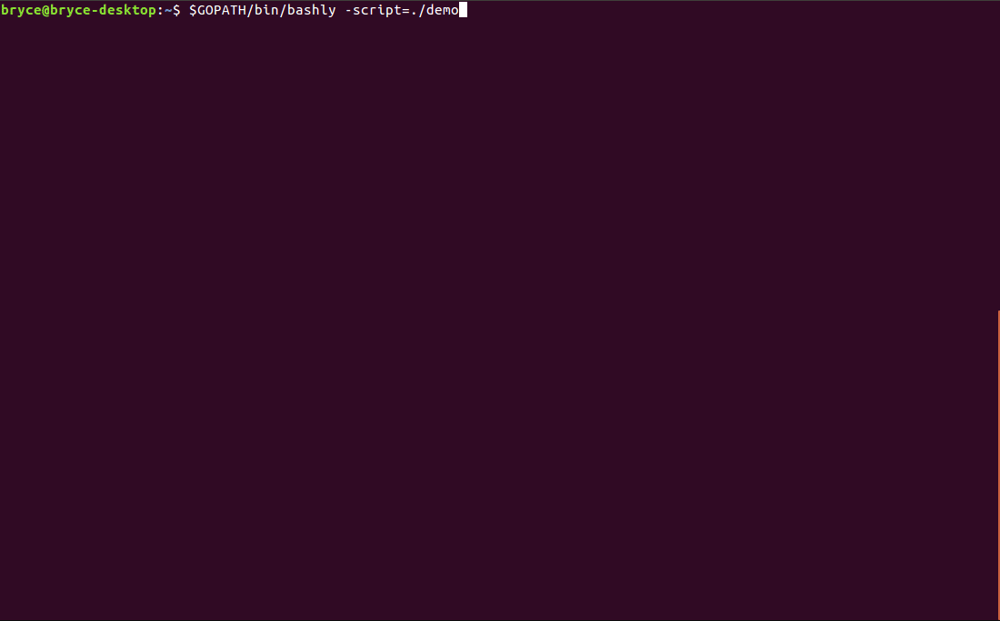

# Bashly
Bashly (bash easily) is a terminal-based application that makes working with Bash scripts a little bit easier by automatically loading relevant command documentation and providing basic searching. This is a small project I built to get familiar with Golang.

## Creating and modifying a contrived script


## Reading a real script (with options box)


## Features
* Editing and saving
* Automatic manual page and option loading
* Basic searching through manual page
* Configurable (box sizes and location)

## To start using Bashly
```
$ go get github.com/brycemcanally/bashly
$ $GOPATH/bin/bashly
```

## Usage output
```
  -config string
    	Custom configuration file
  -script string
    	Script to read/modify
```

## Controls

### Global
Keybinding                              | Description
----------------------------------------|---------------------------------------
<kbd>Ctrl+S</kbd>                       | Exit and save
<kbd>Ctrl+X</kbd>                       | Exit without saving
<kbd>Mouse Wheel Up</kbd>               | Scroll up
<kbd>Mouse Wheel Down</kbd>             | Scroll down
<kbd>Page Up</kbd>                      | Make next box active
<kbd>Page Down</kbd>                    | Make previous box active

### Manual Box
Keybinding                              | Description
----------------------------------------|---------------------------------------
<kbd>Ctrl+F</kbd>                       | Toggle search
<kbd>Enter</kbd>                        | Next match (while searching)
